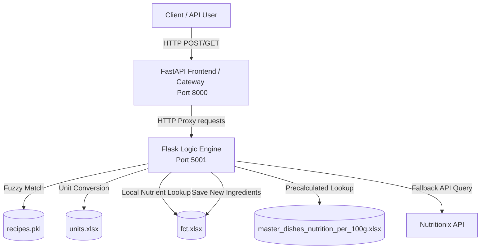

# Food Computing Nutrition Microservices

A dual-framework (Flask + FastAPI) backend application designed to calculate detailed nutritional composition for culinary dishes. The system uses a local database of ingredients (Food Composition Table) and falls back to the external **Nutritionix API** for unknown ingredients.

---

## 🏗 Architecture Overview

The project is structured as a two-tier microservice architecture:



1. **FastAPI Gateway (`fastapi_frontend.py`) [Port 8000]**: 
   - Provides strict type validation using `Pydantic`.
   - Offers interactive Swagger API documentation at `/docs`.
   - Proxies incoming calls to the Flask backend asynchronously using `httpx`.
2. **Flask Calculation Engine (`cal_new.py`) [Port 5001]**:
   - Contains all matching algorithms, parsing logic, and unit conversions.
   - Performs fuzzy search matching on dish names and ingredients.
   - Integrates with the external Nutritionix API.
   - Saves newly discovered ingredients back to the local `fct.xlsx` Excel database.

---

## 📂 Project Structure & Databases

*   [cal_new.py](file:///Users/manishyadav/Documents/work/KCDHA/food-computing/foodComputingNutrition/cal_new.py): Flask application. Runs calculations and exposes internal endpoints on port 5001.
*   [fastapi_frontend.py](file:///Users/manishyadav/Documents/work/KCDHA/food-computing/foodComputingNutrition/fastapi_frontend.py): FastAPI application. Exposes client-facing endpoints on port 8000.
*   `fct.xlsx` *(Food Composition Table)*: Local database containing nutritional breakdown per 100g of various raw ingredients.
*   `units.xlsx`: Unit conversion table containing volume/weight conversions (e.g. cup, tsp to grams) associated with specific ingredients or generic fallbacks.
*   `master_dishes_nutrition_per_100g.xlsx`: Database containing precalculated nutrition details per 100g of fully prepared dishes.
*   `recipes.pkl` **(Required - Not included in Repo)**: Pickled Pandas DataFrame containing dish names, ingredients, and servings details. **You must acquire this file and place it in the project root directory before running the project.**

---

## 🛠 Setup & Installation

### 1. Prerequisites
Ensure you have **Python 3.9+** installed on your system.

### 2. Prepare `recipes.pkl`
This project depends on a `recipes.pkl` file (which is loaded on startup in `cal_new.py`). Ensure you place the `recipes.pkl` file in the root of the project directory.

### 3. Create a Virtual Environment
It is highly recommended to use a virtual environment to manage dependencies:

```bash
# Create environment
python -m venv venv

# Activate environment (macOS/Linux)
source venv/bin/activate

# Activate environment (Windows Command Prompt)
# venv\Scripts\activate
```

### 4. Install Dependencies
Install the required packages using the generated `requirements.txt`:

```bash
pip install -r requirements.txt
```

---

## 🚀 Running the Project

Both microservices must run concurrently. Open two separate terminal windows (with your virtual environment activated):

### Terminal 1: Start the Flask Calculation Engine
```bash
python cal_new.py
```
*Runs on `http://localhost:5001`*

### Terminal 2: Start the FastAPI API Gateway
```bash
python fastapi_frontend.py
```
*Runs on `http://localhost:8000` (Access interactive docs at http://localhost:8000/docs)*

---

## 🔌 API Endpoints & Input/Output Schemas

All FastAPI gateway requests should be sent to `http://localhost:8000`.

### 1. Calculate Dish Nutrition
Calculates the full nutritional profile for a dish by analyzing its recipe ingredients, scaling them by weight, and dividing by servings.
*   **Endpoint:** `POST /api/nutrition`
*   **Request Body (JSON):**
    ```json
    {
      "dish_name": "Paneer Tikka"
    }
    ```
*   **Response (JSON):**
    ```json
    {
      "matched_dish_name": "Paneer Tikka",
      "nutrition_per_serving": {
        "Energy; enerc": 320.5,
        "Total Fat; fatce": 18.2,
        "Protein; protcnt": 15.1,
        "Carbohydrate; choavldf": 8.4
        // ... (other nutritional parameters)
      }
    }
    ```

### 2. Get Dish Ingredients
Retrieves the ingredient mapping showing how raw recipe ingredients are matched with items in the Food Composition Table database.
*   **Endpoint:** `POST /api/ingredients`
*   **Request Body (JSON):**
    ```json
    {
      "dish_name": "Paneer Tikka"
    }
    ```
*   **Response (JSON):**
    ```json
    {
      "matched_dish_name": "Paneer Tikka",
      "ingredients": {
        "paneer cubes": "Cottage cheese, paneer",
        "yogurt": "Yogurt, plain, whole milk"
      }
    }
    ```

### 3. Autocomplete Dish
Performs fuzzy search against the recipe database and returns the top 3 closest matches with matching scores.
*   **Endpoint:** `POST /api/autocomplete`
*   **Request Body (JSON):**
    ```json
    {
      "dish_name": "paner tika"
    }
    ```
*   **Response (JSON):**
    ```json
    {
      "input_dish_name": "paner tika",
      "matched_dish_name": "Paneer Tikka",
      "match_score": 85.0,
      "top_matches": [
        { "name": "Paneer Tikka", "score": 85.0 },
        { "name": "Paneer Butter Masala", "score": 62.0 },
        { "name": "Chicken Tikka", "score": 58.0 }
      ]
    }
    ```

### 4. Aggregated Nutrition for Multiple Dishes
Calculates the combined nutritional totals for a list of dishes.
*   **Endpoint:** `POST /api/agg_nutrition`
*   **Request Body (JSON):**
    ```json
    {
      "dishes": ["Paneer Tikka", "Butter Naan"]
    }
    ```
*   **Response (JSON):**
    ```json
    {
      "matched_dish_names": {
        "Paneer Tikka": "Paneer Tikka",
        "Butter Naan": "Naan, buttered"
      },
      "nutrition_per_serving": {
        "Energy; enerc": 580.2,
        "Total Fat; fatce": 25.8,
        "Protein; protcnt": 21.3
        // ... (combined totals)
      },
      "skipped_dishes": []
    }
    ```

### 5. Fetch Precalculated Nutrition
Retrieves the pre-computed nutritional breakdown per 100g of a dish directly from `master_dishes_nutrition_per_100g.xlsx`.
*   **Endpoint:** `POST /api/fetch_nutrition`
*   **Request Body (JSON):**
    ```json
    {
      "dish": "Biryani"
    }
    ```
*   **Response (JSON):**
    ```json
    {
      "nutrition_data": {
        "Energy; enerc": 150.0,
        "Protein; protcnt": 5.4,
        "Total Fat; fatce": 4.1
        // ... (nutrients per 100g)
      }
    }
    ```

### 6. Convert Natural Language Unit to Grams
Parses natural language ingredient quantities (e.g. "one and a half cups") and converts them into weight in grams.
*   **Endpoint:** `POST /api/convert_to_grams`
*   **Request Body (JSON):**
    ```json
    {
      "string_to_convert": "one and a half cups flour"
    }
    ```
*   **Response (JSON):**
    ```json
    {
      "original": "one and a half cups flour",
      "parsed": {
        "quantity": 1.5,
        "unit": "cup",
        "ingredient": "flour"
      },
      "grams": 180.0
    }
    ```

### 7. Ingredient Search
Provides matches from the database for a raw list of ingredients.
*   **Endpoint:** `POST /api/ingredient_search`
*   **Request Body (JSON):**
    ```json
    {
      "ingredients": ["paneer", "garlic paste"]
    }
    ```
*   **Response (JSON):**
    ```json
    {
      "matched_ingredients": {
        "paneer": "Cottage cheese, paneer",
        "garlic paste": "Garlic, raw"
      }
    }
    ```

---

## ⚙️ Developer Notes & Code Modifiers

When working on modifications to this project, keep the following guidelines in mind:

### Fuzzy Matching Thresholds
- Fuzzy search matches are powered by `rapidfuzz`. The threshold for matching dishes (in `match_recipe` and `match_from_precalculated`) is set to **75** by default.
- The ingredient matcher (`find_ingredient`) matches names with token sort ratio >= **80**. If no match meets this threshold, it falls back to a case-insensitive substring search inside the `Alternate Name; alt_name` column of `fct.xlsx`.

### Database Writes on API Calls
- Calling `POST /api/nutrition` or `POST /api/agg_nutrition` calls `calculate_nutrition_for_dish()`, which automatically writes the local state of `nutrition_df` back to `fct.xlsx` via `nutrition_df.to_excel(INGREDIENTS_PATH, index=False)`. Ensure the script has read and write permissions in the workspace directory.

### External API Keys & Rate Limits
- When the local database `fct.xlsx` does not have an ingredient, the calculation engine sends a POST query to the Nutritionix API.
- If you start running into **Nutritionix rate limit errors**, register for a free API key at [developer.nutritionix.com](https://developer.nutritionix.com/) and update the following lines in [cal_new.py](file:///Users/manishyadav/Documents/work/KCDHA/food-computing/foodComputingNutrition/cal_new.py):
  ```python
  headers = {
      'Content-Type': 'application/json',
      'x-app-id': 'YOUR_APP_ID',
      'x-app-key': 'YOUR_APP_KEY'
  }
  ```
