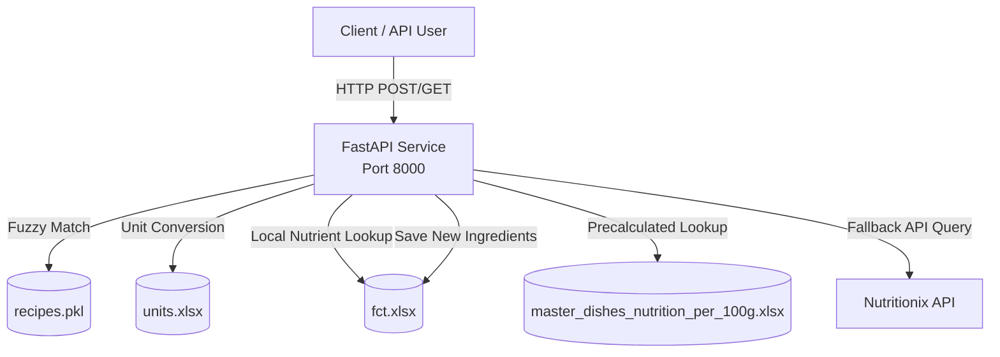

# Food Computing Nutrition API

A unified FastAPI backend service for calculating detailed nutritional composition of culinary dishes. The system fuzzy-matches dish names to a recipe database, resolves ingredients against a local Food Composition Table (FCT), and falls back to the **Nutritionix API** for unknown ingredients.

---

## 🏗 Architecture Overview

The project runs as a single FastAPI service with a clean separation between routing, schemas, and business logic:



**Key components:**
- **Routers** (`backend/app/routers/nutrition.py`): Request validation, error handling, and HTTP response shaping.
- **Schemas** (`backend/app/schemas.py`): Pydantic models enforcing strict type contracts on all inputs and outputs.
- **Calculator Service** (`backend/app/services/calculator.py`): All matching algorithms, parsing logic, unit conversions, and Nutritionix integration.

---

## 📂 Project Structure

```
foodComputingNutrition/
├── backend/
│   ├── app/
│   │   ├── __init__.py
│   │   ├── main.py                    # FastAPI app entrypoint
│   │   ├── schemas.py                 # Pydantic request/response models
│   │   ├── routers/
│   │   │   ├── __init__.py
│   │   │   └── nutrition.py           # All API route handlers
│   │   └── services/
│   │       ├── __init__.py
│   │       └── calculator.py          # Business logic & dataset loaders
│   └── requirements.txt               # Python dependencies
├── fct.xlsx                            # Food Composition Table (nutrients per 100g)
├── units.xlsx                          # Unit-to-gram conversion table
├── recipes.pkl                         # Recipe database (required, not in repo)
├── master_dishes_nutrition_per_100g.xlsx  # Precalculated dish nutrition
└── README.md
```

### Data Files

| File | Description |
|---|---|
| `fct.xlsx` | Local database of nutritional breakdown per 100g of raw ingredients. Grows automatically when the Nutritionix fallback discovers new ingredients. |
| `units.xlsx` | Unit conversion table mapping volume/weight units (cup, tsp, tbsp, oz, etc.) to grams, with optional ingredient-specific overrides. |
| `recipes.pkl` | Pickled Pandas DataFrame containing dish names, ingredient lists, quantity descriptions, and servings. **Required — not included in repo.** |
| `master_dishes_nutrition_per_100g.xlsx` | Precalculated nutrition per 100g of fully prepared dishes for fast lookup. |

---

## 🛠 Setup & Installation

### 1. Prerequisites
- **Python 3.10+** installed on your system.
- `recipes.pkl` placed in the project root directory.

### 2. Create a Virtual Environment

```bash
python -m venv venv

# Activate (macOS/Linux)
source venv/bin/activate

# Activate (Windows)
# venv\Scripts\activate
```

### 3. Install Dependencies

```bash
pip install -r backend/requirements.txt
```

---

## 🚀 Running the Project

Single command, single terminal:

```bash
python -m uvicorn backend.app.main:app --host 0.0.0.0 --port 8000
```

*Access interactive Swagger docs at [http://localhost:8000/docs](http://localhost:8000/docs)*

---

## 🔌 API Endpoints & Input/Output Schemas

All endpoints are prefixed with `/api/v1/nutrition`. Send requests to `http://localhost:8000`.

### 1. Dish Nutrition (Combined)
Matches a dish, returns its ingredient mapping AND per-serving nutrition in a single payload.
*   **Endpoint:** `POST /api/v1/nutrition/dish`
*   **Request Body (JSON):**
    ```json
    {
      "dish_name": "Paneer Tikka"
    }
    ```
*   **Response (JSON):**
    ```json
    {
      "matched_dish_name": "Achari Paneer Tikka",
      "ingredients": {
        "Paneer": "Paneer",
        "Mustard oil": "Mustard oil",
        "Onion": "Onion, big"
      },
      "nutrition_per_serving": {
        "Energy; enerc": 764.76,
        "Total Fat; fatce": 50.33,
        "Protein; protcnt": 55.77
      }
    }
    ```

### 2. Calculate Nutrition Only
Calculates per-serving nutrition without returning the ingredient mapping.
*   **Endpoint:** `POST /api/v1/nutrition/nutrition`
*   **Request Body (JSON):**
    ```json
    {
      "dish_name": "Paneer Tikka"
    }
    ```
*   **Response (JSON):**
    ```json
    {
      "matched_dish_name": "Achari Paneer Tikka",
      "nutrition_per_serving": {
        "Energy; enerc": 764.76,
        "Total Fat; fatce": 50.33,
        "Protein; protcnt": 55.77
      }
    }
    ```

### 3. Get Dish Ingredients
Retrieves the ingredient mapping showing how raw recipe ingredients are matched to the FCT database.
*   **Endpoint:** `POST /api/v1/nutrition/ingredients`
*   **Request Body (JSON):**
    ```json
    {
      "dish_name": "Paneer Tikka"
    }
    ```
*   **Response (JSON):**
    ```json
    {
      "matched_dish_name": "Achari Paneer Tikka",
      "ingredients": {
        "Paneer": "Paneer",
        "Mustard oil": "Mustard oil",
        "yogurt": "Yogurt, plain, whole milk"
      }
    }
    ```

### 4. Autocomplete Dish
Performs fuzzy search against the recipe database and returns the top 3 closest matches with scores.
*   **Endpoint:** `POST /api/v1/nutrition/autocomplete`
*   **Request Body (JSON):**
    ```json
    {
      "dish_name": "paneer tikka"
    }
    ```
*   **Response (JSON):**
    ```json
    {
      "input_dish_name": "paneer tikka",
      "matched_dish_name": "Achari Paneer Tikka",
      "match_score": 87.0,
      "top_matches": [
        { "name": "Achari Paneer Tikka", "score": 87.0 },
        { "name": "Hariyali Paneer Tikka (Stovetop & Oven)", "score": 83.3 },
        { "name": "Paneer Tikka Shashlik: Grilled Paneer Tikka Skewers", "score": 83.3 }
      ]
    }
    ```

### 5. Aggregated Nutrition for Multiple Dishes
Calculates the combined nutritional totals for a list of dishes, reporting any that could not be matched.
*   **Endpoint:** `POST /api/v1/nutrition/aggregate`
*   **Request Body (JSON):**
    ```json
    {
      "dishes": ["Paneer Tikka", "Biryani"]
    }
    ```
*   **Response (JSON):**
    ```json
    {
      "matched_dish_names": {
        "Paneer Tikka": "Achari Paneer Tikka",
        "Biryani": "Chettinad Kathirikai Chops Recipe - Brinjal Curry for Biryani"
      },
      "nutrition_per_serving": {
        "Energy; enerc": 1045.78,
        "Total Fat; fatce": 89.47,
        "Protein; protcnt": 66.71
      },
      "skipped_dishes": []
    }
    ```

### 6. Fetch Precalculated Nutrition
Retrieves the pre-computed nutritional breakdown per 100g directly from `master_dishes_nutrition_per_100g.xlsx`.
*   **Endpoint:** `POST /api/v1/nutrition/fetch`
*   **Request Body (JSON):**
    ```json
    {
      "dish": "Biryani"
    }
    ```
*   **Response (JSON):**
    ```json
    {
      "nutrition_data": {
        "Energy; enerc": 99.27,
        "Protein; protcnt": 8.27,
        "Total Fat; fatce": 9.01
      }
    }
    ```

### 7. Ingredient Search
Matches a list of raw ingredient names to the nearest entries in the FCT database.
*   **Endpoint:** `POST /api/v1/nutrition/ingredient-search`
*   **Request Body (JSON):**
    ```json
    {
      "ingredients": ["paneer", "garlic paste"]
    }
    ```
*   **Response (JSON):**
    ```json
    {
      "matched_ingredients": {
        "paneer": "Paneer",
        "garlic paste": "garlic paste"
      }
    }
    ```

### 8. Convert Natural Language Unit to Grams
Parses natural language ingredient quantities (e.g., "one and a half cups flour") and converts them into weight in grams.
*   **Endpoint:** `POST /api/v1/nutrition/convert-to-grams`
*   **Request Body (JSON):**
    ```json
    {
      "string_to_convert": "one and a half cups flour"
    }
    ```
*   **Response (JSON):**
    ```json
    {
      "original": "one and a half cups flour",
      "parsed": {
        "quantity": 1.5,
        "unit": "cup",
        "ingredient": "flour"
      },
      "grams": 360.0
    }
    ```

---

## ⚙️ Developer Notes

### Fuzzy Matching Thresholds
- Dish matching (`match_recipe`, `match_from_precalculated`) uses a composite scorer (`smart_score`) that takes the best of `fuzz.ratio`, `token_sort_ratio`, `token_set_ratio`, and `partial_ratio`. Minimum threshold: **75**.
- Ingredient matching (`find_ingredient`) uses `token_sort_ratio` with a threshold of **80**. Falls back to case-insensitive substring search in the `Alternate Name; alt_name` column of `fct.xlsx`.

### Database Writes on API Calls
- Endpoints that trigger `calculate_nutrition_for_dish()` — specifically `/dish`, `/nutrition`, and `/aggregate` — write the in-memory `nutrition_df` back to `fct.xlsx` after each call via `save_nutrition_db()`. This persists any new ingredients discovered via Nutritionix. Ensure the process has write permissions to the project root.

### External API Keys & Rate Limits
- When the local FCT does not have an ingredient, the calculator service sends a POST request to the Nutritionix API.
- If you encounter **401 or rate limit errors**, register for a free API key at [developer.nutritionix.com](https://developer.nutritionix.com/) and update the following constants in `backend/app/services/calculator.py`:
  ```python
  _NUTRITIONIX_HEADERS = {
      "Content-Type": "application/json",
      "x-app-id": "YOUR_APP_ID",
      "x-app-key": "YOUR_APP_KEY",
  }
  ```

### Data File Resolution
- All data files (`recipes.pkl`, `fct.xlsx`, `units.xlsx`, `master_dishes_nutrition_per_100g.xlsx`) are resolved relative to the project root using `Path(__file__).resolve().parents[3]` from inside `calculator.py`. No environment variables or hardcoded absolute paths are needed.
